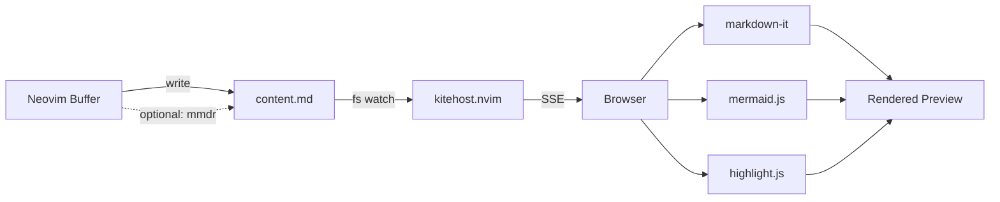

# mdkite.nvim

> **Note:** Before 2.0.0 this plugin was `markdown-preview.nvim`: [Upgrading from markdown-preview.nvim](#upgrading-from-markdown-previewnvim) maps the names it had then. Before that it was `mermaid-playground.nvim`, renamed and rewritten to support full Markdown preview alongside first-class Mermaid diagram support.

Live **Markdown preview** for Neovim with first-class **Mermaid diagram** support.

- Renders your entire `.md` file in the browser: headings, tables, code blocks, everything
- **Relative images work**: `` next to your `.md` file renders in the preview
- **Mermaid diagrams** render inline as interactive SVGs (click to expand, zoom, pan, export)
- **Instant updates** via Server-Sent Events (no polling) with **scroll sync**: browser follows your cursor
- **LaTeX math**: inline `$...$` and display `$$...$$` rendered via KaTeX
- **Syntax highlighting** for code blocks (highlight.js)
- Dark / Light theme toggle with colored heading accents
- **Optional Rust-powered rendering**: use [`mermaid-rs-renderer`](https://github.com/1jehuang/mermaid-rs-renderer) for ~400x faster mermaid diagrams
- **Zero external dependencies**: no npm, no Node.js, just Neovim + your browser
- Powered by [`kitehost.nvim`](https://github.com/selimacerbas/kitehost.nvim) (pure Lua HTTP server)

---

## Quick start

### Install (lazy.nvim)

```lua
{
  "selimacerbas/mdkite.nvim",
  -- a kitehost.nvim checkout under another dir name needs its spec to
  -- say name = "kitehost.nvim", or lazy.nvim clones upstream beside it
  dependencies = { "selimacerbas/kitehost.nvim" },
  -- kitehost.nvim v2.0.0 or newer, the first release with its Host check
  config = function()
    require("mdkite").setup({
      -- all optional; sane defaults shown
      instance_mode = "takeover",  -- "takeover" (one tab) or "multi" (tab per instance)
      port = 0,                    -- 0 = auto (8421 for takeover, OS-assigned for multi)
      open_browser = true,
      default_theme = "dark",      -- "dark" or "light"; initial preview theme
      debounce_ms = 300,
    })
  end,
}
```

No prereqs. No `npm install`. Just install and go.

### Use it

Open any Markdown file, then:

- **Start preview:** `:MdKite` (or `:MdKite start`)
- **Edit freely**: the browser updates instantly as you type
- **Force refresh:** `:MdKite refresh`
- **Stop:** `:MdKite stop`

> The first start opens your browser. Subsequent updates reuse the same tab.

**A dotted filetype with a `markdown` part**, such as `rzk.markdown` for a literate file, previews whole as Markdown too, with no config: Neovim reads a dotted filetype as each of its parts in turn. Other filetypes join them through `filetypes` (see [Other filetypes](#other-filetypes)).

**`.mmd` / `.mermaid` files** are fully supported: the entire file is rendered as a diagram.

For **other non-markdown files**, place your cursor inside a fenced ```` ```mermaid ```` block: the plugin extracts and previews just that diagram.

---

## Upgrading from markdown-preview.nvim

Before 2.0.0 this plugin was markdown-preview.nvim. Through 2.x the former spec still installs it, since GitHub redirects the repository's former name; the former module and commands still work, each warning once a session and naming its replacement, and the former opt-out global still opts out. All three are removed in 3.0.0. Everything else in the table takes the new name now.

| What | markdown-preview.nvim | mdkite.nvim |
| --- | --- | --- |
| lazy.nvim spec | `"selimacerbas/markdown-preview.nvim"` | `"selimacerbas/mdkite.nvim"` |
| Server dependency | `"selimacerbas/live-server.nvim"` | `"selimacerbas/kitehost.nvim"`, v2.0.0 or newer (live-server.nvim's new name) |
| Module | `require("markdown_preview")` | `require("mdkite")` |
| Notice prefix | `Markdown Preview:` | `mdkite:` on every notice this plugin makes (the server's own notices begin `kitehost:`), but a deprecation warning, which is Neovim's own text (`:MarkdownPreview is deprecated, use :MdKite start instead.`) |
| Cache directory | `stdpath("cache")/markdown-preview` | `stdpath("cache")/mdkite` |
| Opt-out global | `vim.g.loaded_markdown_preview` | `vim.g.loaded_mdkite` (the former one still opts out) |
| Auto-refresh augroup | `MarkdownPreviewAuto` | `MdKiteAuto` |
| Browser console prefix | `[markdown-preview]` | `[mdkite]` |

| Command before 2.0.0, removed in 3.0.0 | Runs, after a warning once a session |
| --- | --- |
| `:MarkdownPreview` | `:MdKite start` |
| `:MarkdownPreviewRefresh` | `:MdKite refresh` |
| `:MarkdownPreviewStop` | `:MdKite stop` |

In takeover mode, a preview of a release before 2.0.0 still running in another Neovim keeps its lock under the former cache directory: `:MdKite` names it and its port in one error and starts nothing beside it; stop it there, then run `:MdKite` again.

Through 2.x the plugin ships two top-level modules, `mdkite` and `markdown_preview`, and lazy.nvim finds the module an `opts` table goes to by the spec's name. A spec that relies on `opts` or `config = true` and is named after neither repository (a `name` or `dir` of your own, or a fork under another name) sets `main = "mdkite"`: lazy.nvim cannot choose between the two modules for it and reports `Lua module not found for config of <name>`. `"selimacerbas/mdkite.nvim"`, the former spec, a fork that keeps the name mdkite.nvim and a spec with its own `config` function need none.

---

## Commands

| Command   | Subcommand | Description                                  |
|-----------|------------|----------------------------------------------|
| `:MdKite` | `start`    | Start preview (a bare `:MdKite` does this)   |
| `:MdKite` | `stop`     | Stop preview                                 |
| `:MdKite` | `refresh`  | Force refresh                                |
| `:MdKite` | `toggle`   | Start preview, or stop the one running       |

No subcommand takes an argument, and `<Tab>` completes them; an unknown name, or an argument after one, is one error notice and runs nothing. The commands before 2.0.0 are under [Upgrading from markdown-preview.nvim](#upgrading-from-markdown-previewnvim).

No keymaps are set by default. Map them however you like. Suggested:

```lua
vim.keymap.set("n", "<leader>mps", "<cmd>MdKite start<cr>", { desc = "Markdown: Start preview" })
vim.keymap.set("n", "<leader>mpS", "<cmd>MdKite stop<cr>", { desc = "Markdown: Stop preview" })
vim.keymap.set("n", "<leader>mpr", "<cmd>MdKite refresh<cr>", { desc = "Markdown: Refresh preview" })
```

---

## Browser UI

The preview opens a polished browser app with:

- **Full Markdown rendering**: GitHub-flavored styling with colored heading borders, lists, tables, blockquotes, code, images, links, horizontal rules
- **Syntax-highlighted code blocks**: powered by highlight.js, with language badges
- **Interactive Mermaid diagrams**, rendered inline as SVGs:
  - Hover a diagram to reveal the **expand button**
  - Click to open a **fullscreen overlay** with zoom, pan, fit-to-width/height, and SVG export
- **Dark / Light theme** toggle (sun/moon icon in header)
- **Live connection indicator**: green dot when SSE is connected
- **Per-diagram error handling**: if one mermaid block is invalid, only that block shows an error; the rest of the page renders fine
- **LaTeX math rendering**: `$E = mc^2$` inline and `$$\int_0^\infty$$` display math via KaTeX, plus `\begin{equation}` environments
- **Scroll sync**: browser follows your cursor position with line-level precision
- **Iconify auto-detection**: icon packs like `logos:google-cloud` are loaded on demand

---

## Configuration

```lua
require("mdkite").setup({
  instance_mode = "takeover",           -- "takeover" or "multi" (see below)
  port = 0,                             -- 0 = auto (8421 for takeover, OS-assigned for multi)
  host = "127.0.0.1",                   -- bind address; "0.0.0.0" for network access (see Remote access)
  open_browser = true,                  -- auto-open browser on start

  -- nil = system default browser
  -- string = browser name ("Firefox") or binary ("google-chrome")
  -- table = full command, URL appended ({ "google-chrome", "--incognito" })
  -- On macOS, string values are passed via `open -a <name>`.
  browser = nil,

  content_name = "content.md",          -- workspace content file
  index_name = "index.html",            -- workspace HTML file
  custom_css = "",                      -- CSS file layered over bundled styles (~ and $VARS ok; "" = off)
  workspace_dir = nil,                  -- nil = auto (shared for takeover, per-buffer for multi); multi mode serves a set directory whole, so keep nothing else in it: on a network bind its other files need no token

  overwrite_index_on_start = true,      -- copy plugin's index.html on every start

  auto_refresh = true,                  -- auto-update on buffer changes
  auto_refresh_events = {               -- which events trigger refresh
    "InsertLeave", "TextChanged", "TextChangedI", "BufWritePost"
  },
  debounce_ms = 300,                    -- debounce interval
  notify_on_refresh = false,            -- show notification on refresh

  mermaid_renderer = "js",              -- "js" (browser mermaid.js) or "rust" (mmdr CLI, ~400x faster)

  default_theme = "dark",               -- "dark" or "light"; initial preview theme (toggleable in browser)

  yaml_mode = "panel",                  -- front matter: "panel" (collapsible above preview), "hide", or "raw"

  filetypes = {},                       -- more filetypes previewed whole as markdown, e.g. { "quarto", "rmd" } (see Other filetypes)

  allow_raw_html = true,                -- render raw HTML in markdown; false is meant to render it as text and is being hardened (see Security)

  scroll_sync = true,                   -- browser follows cursor position

  -- Fraction (0–1): vertical position of the final line when scrolled to end.
  -- 0.5 = middle of viewport (default), 1.0 = bottom edge (no extra space)
  bottom_padding = 0.5,

  hooks = {
    on_start = nil,   -- fun(url: string)|nil, called after preview starts
    on_stop  = nil,   -- fun()|nil, called after preview stops
  },
})
```

### Other filetypes

A buffer previews whole as Markdown when its filetype is `markdown` or a dotted one with a `markdown` part (`rzk.markdown`), with no config. `filetypes` adds filetypes with no such part:

```lua
require("mdkite").setup({
  filetypes = { "quarto", "rmd" },
})
```

The list adds to `markdown` and never replaces it. A value that is not a list of filetype names (a bare string, a number in the list, an empty name) is refused by `setup()` with one error notice, and that call changes nothing. A `.mmd` or `.mermaid` file needs no entry: it previews as one diagram. Naming `mermaid` in `filetypes` would preview such a buffer whole as Markdown, so its diagram shows as text. Any other buffer previews the mermaid block under the cursor.

### Hooks

Lifecycle callbacks that run when the preview starts or stops. Use them for notifications, logging, or triggering other actions.

```lua
require("mdkite").setup({
  hooks = {
    on_start = function(url)
      vim.notify("Preview started: " .. url, vim.log.levels.INFO)
    end,
    on_stop = function()
      vim.notify("Preview stopped", vim.log.levels.INFO)
    end,
  },
})
```

- **`on_start(url)`**: called after the server is ready, before the browser opens. Receives the preview URL as a string.
- **`on_stop()`**: called after the server is stopped and all cleanup is done.

### Remote access (SSH)

If you're running Neovim on a remote machine over SSH and want to view the preview on your local machine, bind to all interfaces and use `on_start` to print the URL:

```lua
require("mdkite").setup({
  host = "0.0.0.0",
  open_browser = false,
  hooks = {
    on_start = function(url)
      vim.notify("mdkite: " .. url, vim.log.levels.INFO)
    end,
  },
})
```

The notification will show the full URL including the auth token (e.g. `http://10.0.0.5:8421/?t=...`). Most terminals support **Ctrl+Shift+click** on the URL to open it directly in your local browser.

> **Security notes for network binding**
>
> - With any `host` but `127.0.0.1` and `localhost` (which binds `127.0.0.1`), `::1` included, the tokenized URL is required for *everything* the plugin writes, including the page itself: requests without `?t=<token>` get 401. Peers on your network cannot read your buffer without the URL. A `workspace_dir` set in multi mode is served whole, so any other file you keep there is readable without it.
> - Traffic is plain, unencrypted HTTP. Anyone who obtains the URL (or can sniff the local network) can read the previewed buffer while the preview runs.
> - Takeover mode supports `host = "127.0.0.1"`, `"localhost"` (which binds `127.0.0.1`) or `"0.0.0.0"` only. To bind a specific interface, use `instance_mode = "multi"`.
> - Zero-config alternative: keep the default loopback bind and tunnel instead: `ssh -L 8421:localhost:8421 <remote>`, then open the URL printed by `on_start` locally. Nothing is exposed to the network, and traffic is encrypted by SSH.

### Instance modes

**Takeover** (default): all Neovim instances share a single workspace and browser tab. The first instance to run `:MdKite` becomes the primary (starts the server on port 8421). Subsequent instances become secondaries: they write content to the shared workspace, and the server's file watcher pushes a reload to the browser. Scroll sync works across instances via HTTP event injection.

**Multi**: each instance gets its own server on an OS-assigned port and its own browser tab. Use this for side-by-side previews of different files.

```lua
require("mdkite").setup({ instance_mode = "multi" })
```

---

## Example



---

## How it works

```
Neovim buffer
    |
    |  (autocmd: debounced write)
    v
workspace/content.md
    |
    |  (kitehost.nvim detects change)
    v
SSE event --> Browser
    |
    |  markdown-it --> HTML
    |  mermaid.js  --> inline SVG diagrams
    |  highlight.js --> syntax highlighting
    |  morphdom    --> efficient DOM diffing
    v
Rendered preview (scroll preserved, no flicker)
```

- **Rust renderer** (`mermaid_renderer = "rust"`): mermaid fences are pre-rendered to SVG via the `mmdr` CLI before writing to `content.md`. The browser receives ready-made SVGs with no mermaid.js overhead. Failed blocks fall back to browser-side rendering automatically.
- **Markdown files** (filetype `markdown`, a dotted one with a `markdown` part, or one listed in `filetypes`): The entire buffer is written to `content.md`
- **Mermaid files** (`.mmd`, `.mermaid`): The entire buffer is wrapped in a mermaid code fence
- **Other files**: The mermaid block under the cursor is extracted (via Tree-sitter or regex fallback) and wrapped in a code fence
- **SSE** (Server-Sent Events) from `kitehost.nvim` push updates instantly (no polling)
- **morphdom** diffs the DOM efficiently, preserving scroll position and interactive state
- **Takeover mode** shares a single workspace (`~/.cache/nvim/mdkite/shared/`) and browser tab across all Neovim instances via a lock file
- **Multi mode** uses per-buffer workspaces under `~/.cache/nvim/mdkite/<hash>/` with independent servers

---

## Dependencies

- **Neovim** 0.10+ (every release needed it; from this one the plugin says so at load instead of failing at first use)
- **[kitehost.nvim](https://github.com/selimacerbas/kitehost.nvim)** v2.0.0 or newer: pure Lua HTTP server (no npm); the plugin names it in one error at start when it is missing or older
- **Tree-sitter** with the **Markdown** parser (recommended for mermaid block extraction)
- **[mermaid-rs-renderer](https://github.com/1jehuang/mermaid-rs-renderer)** (optional): `cargo install mermaid-rs-renderer` for ~400x faster mermaid rendering. Set `mermaid_renderer = "rust"` in config to enable.

Browser-side libraries are loaded from CDN (cached by your browser):
- [markdown-it](https://github.com/markdown-it/markdown-it): Markdown parser
- [KaTeX](https://katex.org/) + [markdown-it-texmath](https://github.com/goessner/markdown-it-texmath): LaTeX math rendering
- [Mermaid](https://mermaid.js.org/): diagram engine
- [highlight.js](https://highlightjs.org/): syntax highlighting
- [morphdom](https://github.com/patrick-steele-idem/morphdom): DOM diffing

---

## Security

- **Local by default.** The preview server binds to `127.0.0.1`. A per-session 128-bit token gates five surfaces: your buffer content (`content.md`), the `asset_root` sidecar, the SSE stream, the event-injection endpoint and the asset route; with any `host` but `127.0.0.1` and `localhost`, the preview page itself requires it too (see *Remote access* above). [SECURITY.md](SECURITY.md) says what the token keeps out on each bind.
- **Raw HTML is rendered by default** (GitHub-like). HTML embedded in markdown runs inside the preview page. With `allow_raw_html = false` the preview is meant to render embedded HTML as text, and that switch is being hardened, so a file you do not trust is previewed at your own risk today.
- **Browser libraries load from CDNs** (jsdelivr/unpkg, see *Dependencies*). Rendering requires internet access, and a compromised script served from a CDN would run in the page that holds the token (see [SECURITY.md](SECURITY.md)). Vendoring the assets locally is planned ([#27](https://github.com/selimacerbas/mdkite.nvim/issues/27)).
- **`custom_css` files are inlined into the preview page** verbatim. Point it only at files you trust.
- **Relative images are served from the previewed file's directory.** The token-gated asset route can serve *any* file at or below that directory (not just images). A previewed file's raw HTML runs in a page that holds the token, so on any bind it can read every file under the source file's directory through the asset route (`.env`, `secrets.txt`, …); on any `host` but `127.0.0.1` and `localhost` anyone holding the tokenized URL can too. Keep sensitive files out of the directory tree you preview from, and prefer an SSH tunnel to a network bind.
- The takeover-mode lock file (which contains the session token) is written with mode `0600`.

---

## Troubleshooting

**WSL: browser doesn't open, or preview unreachable from Windows**
- The plugin tries `wslview`, `explorer.exe`, then `powershell.exe` to open your Windows browser. Installing [wslu](https://wslutiliti.es/wslu/) (`sudo apt install wslu`) is the most reliable option; you can also set `browser = "wslview"` explicitly.
- If no launcher works, a notification shows the preview URL. Open it manually in your Windows browser.
- If `http://127.0.0.1:8421/` is unreachable from Windows, WSL2's localhost forwarding has likely broken (common after sleep, hibernate, or VPN changes). Run `wsl --shutdown` from PowerShell and reopen WSL. Alternatively bind the server to all interfaces (`host = "0.0.0.0"`) and open the URL printed by `hooks.on_start` (see *Remote access*).
- `explorer.exe`/`powershell.exe` require Windows interop; check `/etc/wsl.conf` for `[interop] enabled=false` or `appendWindowsPath=false`.

**Images don't show**
- Relative paths (`pic.png`, `images/pic.png`) are served from the directory of the file being previewed, via a token-gated asset route. Paths that resolve *outside* that directory (e.g. `../shared/pic.png`) are rejected for containment; keep referenced images at or below the markdown file's directory.
- Absolute filesystem paths (`/home/me/pic.png`) are not supported; http(s) URLs load as usual.

**Browser shows nothing or "Loading..."**
- Make sure `kitehost.nvim` v2.0.0 or newer is installed and loadable: `:lua require("kitehost")`
- Check the port isn't in use: change `port` in config

**Mermaid diagram not rendering**
- The diagram syntax must be valid Mermaid. Check the error chip on the diagram block
- Invalid diagrams show the last good render + error message

**Port conflict**
- In takeover mode, stop the other instance first or change the port: `port = 9999`
- In multi mode, ports are auto-assigned. Conflicts shouldn't happen

**Stale lock file (takeover mode)**
- If Neovim crashes, the lock file may persist. The next `:MdKite` detects the dead server and automatically takes over

---

## Project structure

```
mdkite.nvim/
├─ plugin/mdkite.lua                 -- :MdKite, and through 2.x the commands before it
├─ lua/markdown_preview.lua          -- the module's name before 2.0.0, through 2.x
├─ lua/mdkite/
│  ├─ init.lua                       -- main logic (server, refresh, workspace, instance modes)
│  ├─ floor.lua                      -- the Neovim requirement and its message
│  ├─ util.lua                       -- fs helpers, workspace resolution
│  ├─ ts.lua                         -- Tree-sitter mermaid extractor + fallback
│  ├─ lock.lua                       -- lock file management (takeover mode coordination)
│  └─ remote.lua                     -- HTTP event injection (secondary scroll sync)
├─ assets/
│  └─ index.html                     -- browser preview app
├─ lazy.lua                          -- the spec lazy.nvim reads: kitehost.nvim as a dependency
└─ tests/                            -- the headless suites, their harness and runner, and browser/ (the browser smoke test)
```

---

## Thanks

- [Mermaid](https://mermaid.js.org/) for the diagram engine
- [Iconify](https://iconify.design/) for icon packs
- [markdown-it](https://github.com/markdown-it/markdown-it) for Markdown parsing
- [highlight.js](https://highlightjs.org/) for syntax highlighting
- [morphdom](https://github.com/patrick-steele-idem/morphdom) for efficient DOM updates

PRs and ideas welcome: [CONTRIBUTING.md](CONTRIBUTING.md) names the commands CI runs and the commit rules, and [SECURITY.md](SECURITY.md) says how to report a vulnerability privately.
